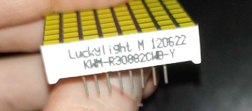
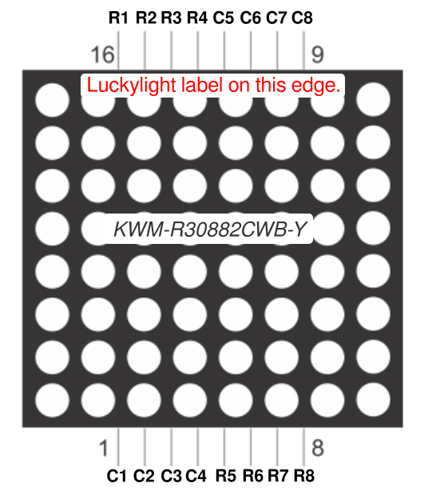

#Luckylight KWM-R30882CWB-Y
I was unable to find an existing datasheet or documentation for this 8x8 LED Matrix so I am publishing the pinout here in the hopes that it may be useful to someone else who has this part. 

Along one edge of the part there is text reading:
```
Luckylight M 120622
KWM-R30882CWB-Y 
```


#Pinout
Thank you to Adafruit's Carter Nelson for creating this pin diagram
